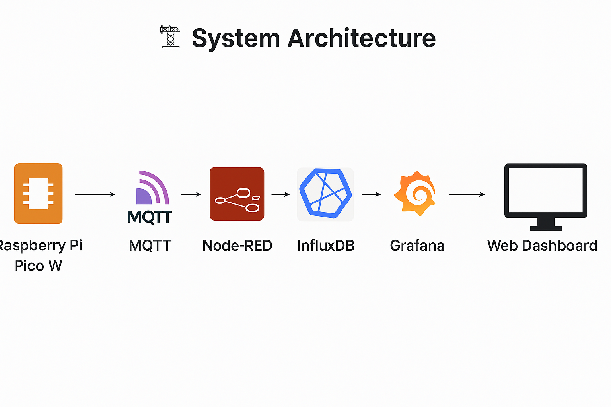
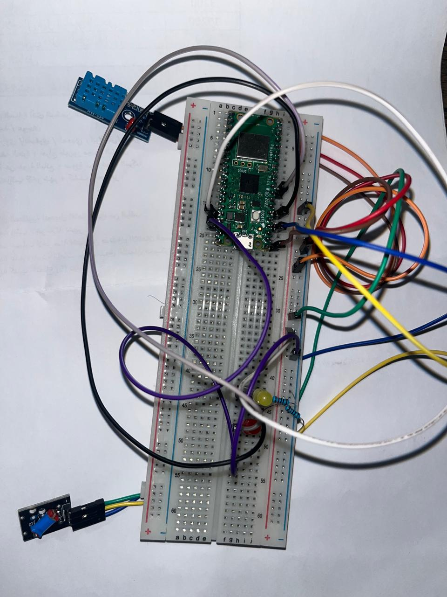

# 🌡️ Pico Environment Monitor

This project demonstrates a complete IoT-based environmental monitoring system using a Raspberry Pi Pico W, DHT11 sensor, MQTT, Node-RED, InfluxDB, and Grafana — all orchestrated via Docker.

It continuously monitors:
- Temperature (°C)
- Humidity (%)
- Tilt status (shock/fall detection)

Data is:
- **Captured** by the Raspberry Pi Pico W
- **Published** to an MQTT broker (Mosquitto)
- **Processed and visualized** via Node-RED
- **Stored** in InfluxDB
- **Displayed** using Grafana dashboards

> This project follows the structure and expectations of the LNU IoT course. It aims to give hands-on experience with microcontrollers, MQTT communication, containerization, and time-series visualization.

## System Architecture

This project uses a modular IoT architecture to monitor environmental conditions such as temperature, humidity, and tilt using a Raspberry Pi Pico W and visualizes the data on a Grafana dashboard.

### 📦 Components Overview

- **Raspberry Pi Pico W**: Collects environmental data via DHT11 and tilt sensor.
- **MQTT (Mosquitto Broker)**: Transfers sensor data wirelessly to the server.
- **Node-RED**: Receives, parses, and forwards MQTT data.
- **InfluxDB**: Time-series database that stores the sensor data.
- **Grafana**: Visualizes data in an interactive dashboard.

### 🔁 Data Flow

1. The Pico W reads data from sensors and publishes it to the MQTT topic `pico/data`.
2. Node-RED subscribes to this topic, formats the data, and forwards it to InfluxDB.
3. InfluxDB stores the timestamped data.
4. Grafana queries the data and presents it as time series charts.

### 🗂 Diagram



> This architecture ensures modularity, easy maintenance, and a real-time view of environmental metrics.

## Hardware

### 🧰 Required Components

To build the Raspberry Pi Pico W - Environment Monitor, the following hardware components are used:

| Component               | Description                                                        |
|-------------------------|--------------------------------------------------------------------|
| Raspberry Pi Pico W     | Main microcontroller board with Wi-Fi support                     |
| DHT11 Temperature Sensor| Measures temperature and humidity                                  |
| Tilt Sensor (e.g., SW-520D or similar) | Detects tilt or vibration                                   |
| Breadboard              | For quick and solderless circuit prototyping                      |
| Jumper Wires (Male-Male)| To connect components on the breadboard                           |
| LED (x2)                | Visual indicators: one for tilt status and another for overheat   |
| 330Ω Resistors (x2)     | Current limiting resistors for the LEDs                           |
| Micro USB cable         | For powering and programming the Raspberry Pi Pico W              |

---

### ⚡ Wiring Diagram

The following table summarizes the wiring configuration used in this project:

| Pico W Pin | Connected To          | Description                  |
|------------|-----------------------|------------------------------|
| GP0        | DHT11 Data Pin        | Temperature & humidity input |
| GP2        | Tilt Sensor Signal Pin| Detects tilt                 |
| GP4        | LED 1 (status)        | Turns on if tilt is detected |
| GP6        | LED 2 (alert)         | Turns on if temperature > 35°C |

> 📌 **Note**: The DHT11 sensor requires a 10kΩ pull-up resistor between VCC and Data for reliable communication. Some modules already have this onboard.

---

### 🔌 Power Supply

- The Raspberry Pi Pico W is powered via Micro USB.
- All sensors and LEDs are powered through the Pico W’s 3.3V and GND pins.

---

### 📷 Hardware Assembly Image



> Above: A real-world image of the project hardware setup. The DHT11 sensor is connected on the left, and the tilt sensor at the bottom left. The Pico W sits at the center of the breadboard with the LEDs to the right.

## Software Setup

This section walks you through setting up the MicroPython code, installing dependencies, and launching all backend services using Docker Compose.

---

### 🧠 4.1 Clone the Project

Start by cloning this repository directly, which includes all the required code and configurations:

```bash
git clone https://github.com/majdhatoum/pico-environment-monitor.git
cd pico-environment-monitor
```

This will give you access to:

- 📂 **The MicroPython code** for your Raspberry Pi Pico W  
- 🐳 **Dockerized backend** (MQTT, Node-RED, InfluxDB, Grafana)  
- 📈 **Preconfigured Node-RED flows** and **Grafana dashboards**  

---

### 📲 4.2 Configure MicroPython on Pico W

#### 🔧 Flashing MicroPython (First Time Only)

1. Hold down the **BOOTSEL** button on the Raspberry Pi Pico W and connect it to your computer via USB.
2. It will appear as a **mass storage device**.
3. Download the latest `.uf2` firmware from the [official MicroPython website](https://micropython.org/download/rp2-pico-w/).
4. Drag and drop the `.uf2` file into the Pico’s USB drive.
5. The Pico will automatically reboot and is now ready for MicroPython development.

### 🧪 Thonny IDE Setup

1. Open **Thonny IDE**.

2. Navigate to:

```bash
Tools > Options > Interpreter
```

3. Set the interpreter to:
```bash
MicroPython (Raspberry Pi Pico W)
```

4. Open the following file from the cloned repository:
```bash
pico/main.py
```


✅ You do **not** need to write the code manually — the script is already included.

---

### ✍️ Edit Wi-Fi and MQTT Credentials

In `main.py`, update the following lines to match your network environment:

```python
# Replace these with your actual Wi-Fi and MQTT settings
ssid = 'your-wifi-ssid'
password = 'your-wifi-password'
mqtt_server = 'your-mqtt-broker-ip'
```

💡 **mqtt_server** should point to the host machine’s local IP address, e.g., `192.168.1.20`.

---

### 🔁 Auto-Start on Boot

Once saved as `main.py`, the script will **automatically run** every time the Raspberry Pi Pico W is **powered on or reset**.

